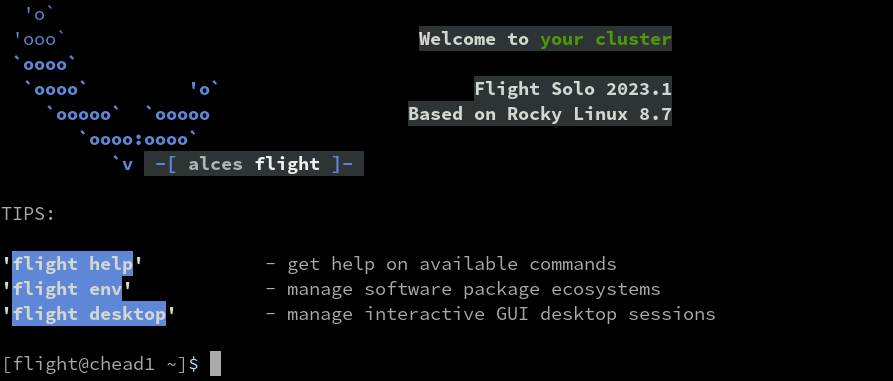

# Flight Environment Basics

## Activate the Flight Environment

The Flight User Suite sits unobtrusively on the research environment with the `flight` command serving as an entrypoint to the various system commands.

This provides some quick tips to activating the system and finding out more about the flight system (`flight info`).

To load the system, simply run `flight start` (which, when first run, will generate some login keys for allowing passwordless login to compute nodes)




!!! tip
    The flight system can be set to automatically start on login for the user by running `flight set always on`

## Flight HowTo

The Flight User Suite comes with built-in guides to assist with usage of the research environment from setting up the flight environment to using the queue system.

### Showing Available Guides

To show the available guides, list them with:
```bash
[flight@chead1 (mycluster1) ~]$ flight howto ls
┌───────┬──────────────────────────────────┐
│ Index │ Name                             │
├───────┼──────────────────────────────────┤
│ 1     │ Get Started                      │
│ 2     │ Work With The Flight Environment │
│ 3     │ Use Flight User Suite            │
│ 4     │ Run Jobs                         │
│ 5     │ Use A Scheduler                  │
│ 6     │ Flight Desktop                   │
│ 7     │ Flight Env                       │
│ 8     │ Flight Job                       │
│ 9     │ Flight Login Api                 │
└───────┴──────────────────────────────────┘
```

### Viewing a Guide

A guide can be viewed by requesting either the index or name of the desired guide. When viewing a guide, the content will open inside a `less` session.

To view the get started guide by name:

```bash
flight howto show 'Get Started'
```

To view the get started guide by index:

```bash
flight howto show 1
```

When finished with the guide, simply escape the `less` session with `q`. Alternatively, the optional argument `--no-pager` will prevent any sort of view manager, instead the contents of the guide will be output straight to the terminal.
