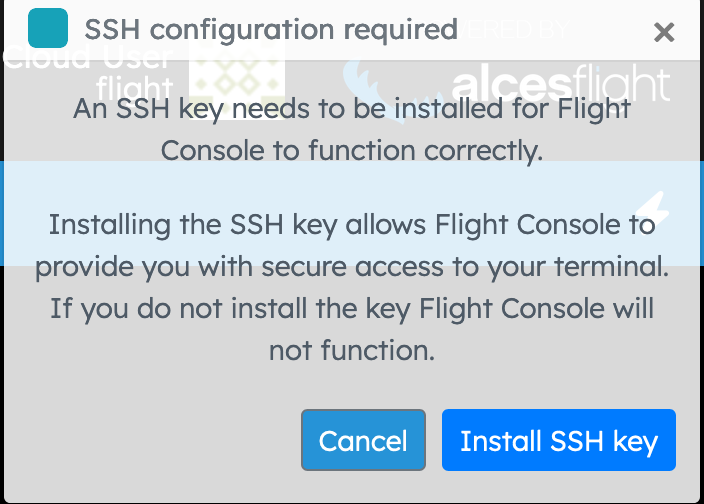
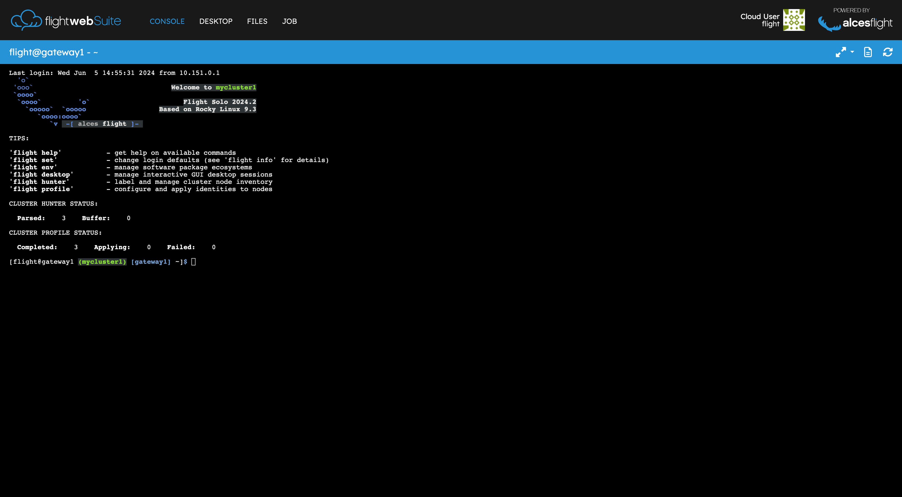

# Flight Console 

The Flight Console provides an embedded terminal in the web browser to directly access the HPC environment. 

!!! tip
    The terminal does not persist when the console page is navigated away from, bear this in mind if performing any long-running commands as the session will need to remain active and connected. Utilising a tool like [`screen`](https://savannah.gnu.org/projects/screen/) will detach processes from the terminal session and run them in a virtual terminal. 

## Connecting to Console

After selecting the Console application from the Landing Page there will be a button prompting to "Connect to the Terminal".

If it's the first time connecting to Flight Console then the will be prompted to install an SSH key to secure the connection between the browser and the console. 

Once the key is installed the user will be presented with a terminal window mirroring the environment.

There are a few options for the terminal view, such as, making it _Full Screen_, changing to _Zen Mode_ (terminal focused with less widgets and buttons polluting the screen) and disconnecting the terminal session.

