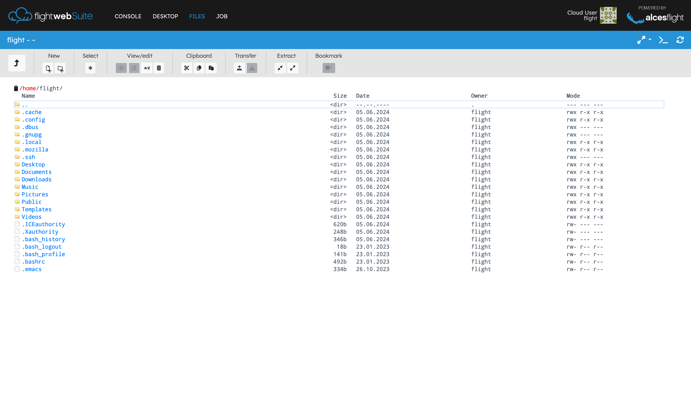
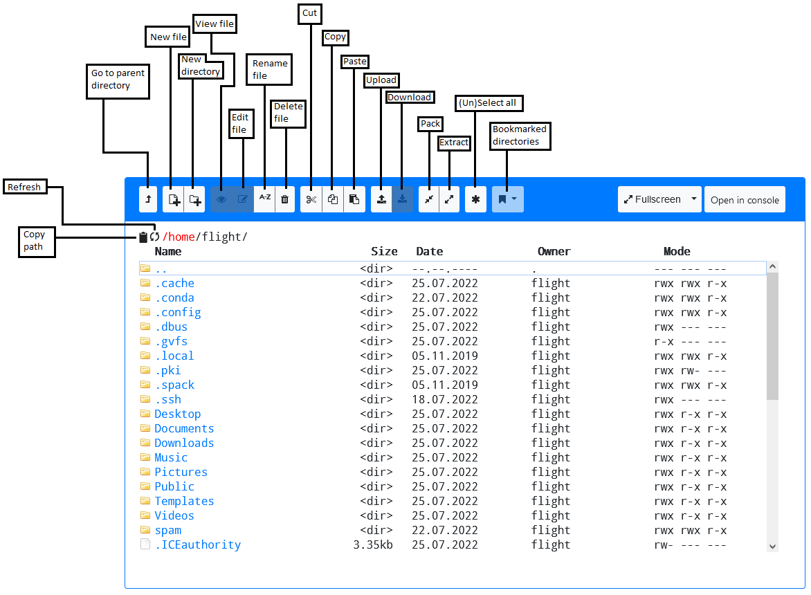

# Flight File Manager

The Flight File Manager provides a way to manage data on the HPC environment by providing a GUI that allows upload, download and even modification of files. 

## Using the File Manager

To start a file manager session for the cluster, select "Manage Files" from the management page. The system will open a UI for managing files.

There are a few options for the file manager, such as, making it _Full Screen_, changing to _Zen Mode_ (terminal focused with less widgets and buttons polluting the screen), and switching to console mode (opening the current directory in [Flight Console](console.md)).

There are several buttons on the top part of the screen, they have been labelled below. All the greyed out buttons (except Bookmarks) can only be used when a file is selected. Additionally, the user can bring up the button menu by right clicking. Right clicking on a particular file or directory will show actions available for that file or directory.

Bookmarks allow the user to quickly change to a bookmarked directory. Currently, bookmarks must be manually set by administrators with root privileges.

