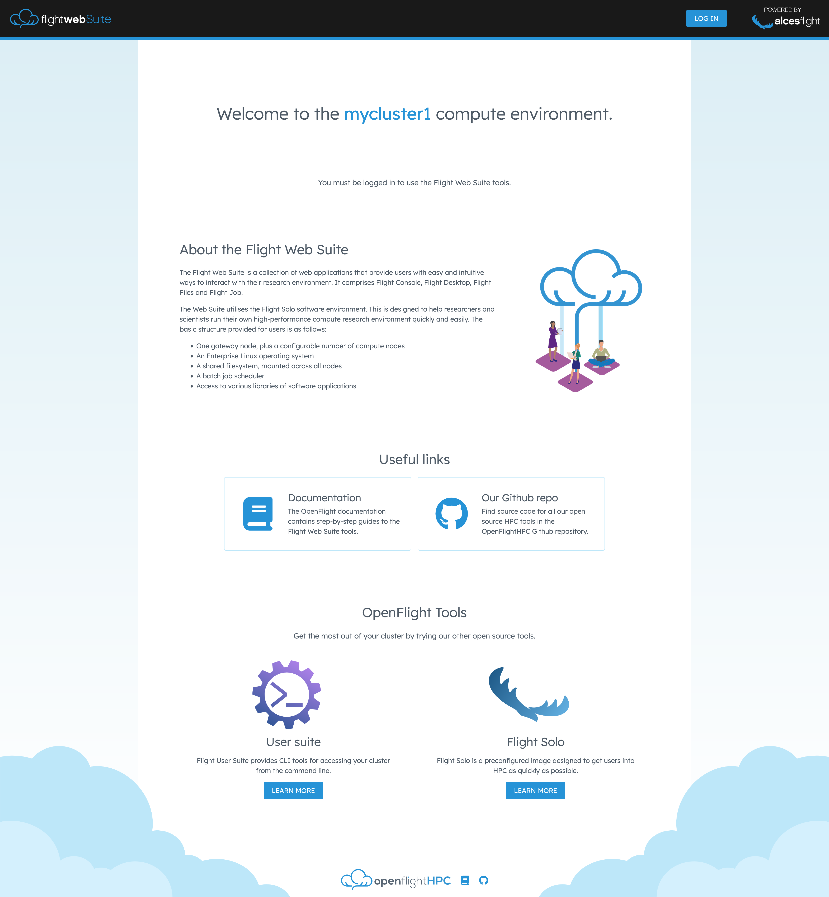
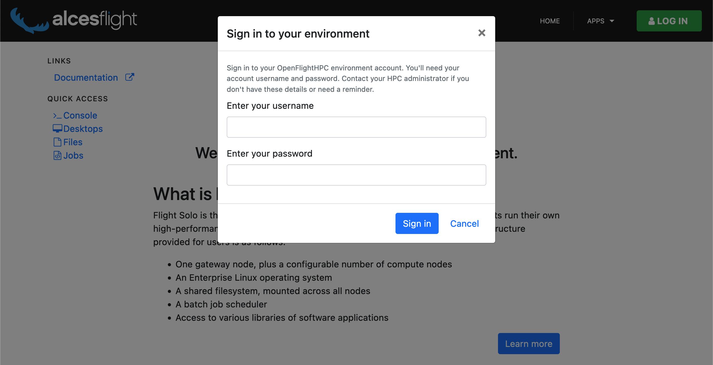
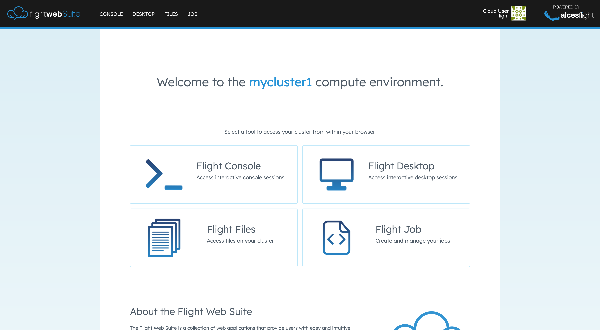

# Web Suite Landing Page

A landing page is presented when navigating to the web suite domain. This page gives a brief description of the HPC environment and presents the cluster name. 

Further to this, the landing page presents the available web applications. 

<figure markdown>
  
  <figcaption markdown>Example landing page on [Flight Solo](../../../flight-solo/index.md)</figcaption>
</figure>

## Logging In

Selecting the `LOG IN` button in the top right of the landing page will present a form to enter your user details. These will match the username and password usually used to access the HPC environment. Once logged in, the session will be authorised to access the rest of the flight web applications.

<figure markdown>
  
  <figcaption markdown>Example login form on [Flight Solo](../../../flight-solo/index.md)</figcaption>
</figure>

Once logged in the available applications will be presented. 

<figure markdown>
  
  <figcaption markdown>Example landing page (logged in) on [Flight Solo](../../../flight-solo/index.md)</figcaption>
</figure>

## Customising the Landing Page

The styling, content and assets used by the landing page can be customised and overridden. For more information on modifying the landing page see the [landing page repository](https://github.com/openflighthpc/flight-landing-page#configuration). 

If any changes are made to the landing page then the web assets will need to be recompiled:
```bash
flight landing-page compile
```

## Adding Applications

The Flight Web Suite runs it's own Nginx server. This allows for services running on localhost to be accessed via the Web Suite acting as a reverse proxy. 

A brief outline of what is required to add your local service to Flight Web Suite is below.

- Install and run your application strictly on localhost on an available port
- Add link to application to the web-suite applications page by placing a file under `/opt/flight/opt/www/landing-page/default/content/apps/` named along the lines of `myapp.md` with content like (note: icons are [FontAwesome v4](https://fontawesome.com/v4/icons/)):
	```markdown
	---
	title: My App Name
	short_title: App
	subtitle: Do Things The App Does
	path: /route/to/server/location
	fa_icon: FontAwesomeIconName
	---
	My App Name allows you to do app things in the app place and this is the description
	of what it does.
	```
- The application server can be defined as part of the `flight-www` webserver by installing an Nginx config file for the service to `/opt/flight/etc/www/server-https.d/` which could look something like the following
	```nginx
	location ^~ /route/to/server/location {
	  proxy_pass http://127.0.0.1:PORT;
	  proxy_set_header X-Real-IP $remote_addr;
	  proxy_set_header Host $host;
	  proxy_set_header X-Forwarded-For $proxy_add_x_forwarded_for;
	  # websocket headers
	  proxy_http_version 1.1;
	  proxy_set_header Upgrade $http_upgrade;
	  proxy_set_header Connection "Upgrade";
	  proxy_set_header X-Scheme $scheme;
	  proxy_buffering off;
	}
	```
- Recompile landing page
	```bash
	flight landing-page compile
	```
- Restart web server
	```bash
	flight service restart www
	```
