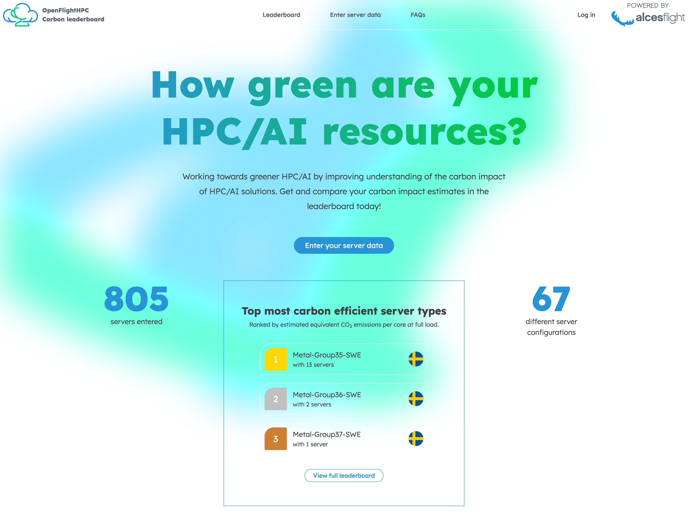
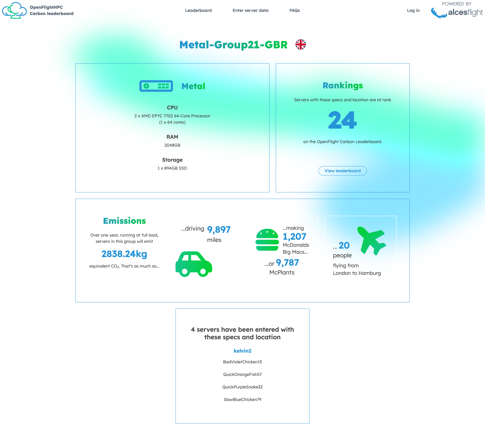

# Carbon Leaderboard

The [OpenFlight Carbon Leaderboard](https://leaderboard.openflighthpc.org/) is a community initiative aiming to provide a simple methodology and clear comparison of Carbon Impact Estimates for a range of servers while adding a light competitive edge. This service should be used to help get an understanding of the impact of resources (both physical and virtual) at various levels of load. 

If you choose to [add your device](https://leaderboard.openflighthpc.org/data-entry), you can view and compare the carbon impact (along with some comparisons to help visualise it). This can aid in comprehending just how much the devices within your estate are contributing to global carbon impact and how they compare to other devices in HPC estates. 

More information on the Carbon Leaderboard can be found in the [FAQs](https://leaderboard.openflighthpc.org/faq) 
