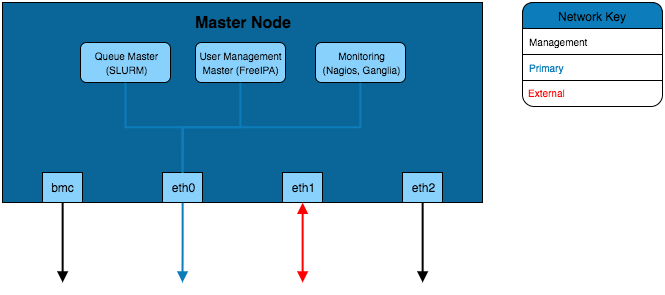
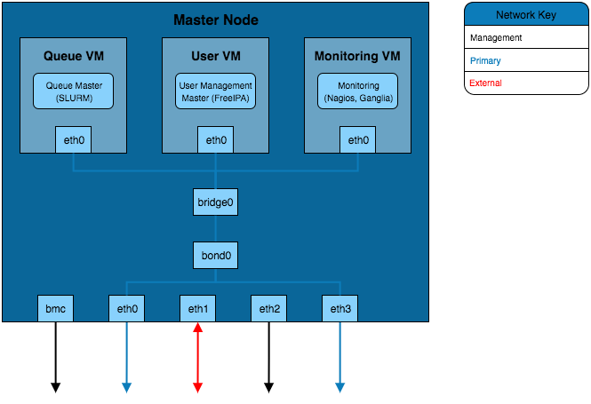
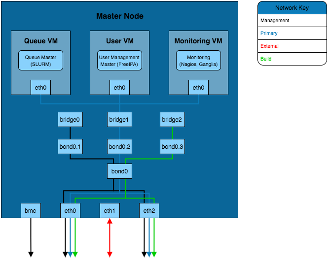

# Considerations for Infrastructure Design

Infrastructure design largely relates to the considerations made for the [cluster architecture](network-hardware.md#hardware-recommendations). Depending on the design being used, some of the infrastructure decisions may have already been made.

## Infrastructure Service Availability

There are typically 3 possible service availability options to choose from, these are:

- All-in-one
- VM Platform
- High Availability VM Platform

These are covered in more detail below.

!!! note
    If using a Cloud Platform then the service availability will be handled by the cloud provider. The only additional considerations are how services will be provided in terms of native running services or containerised.

### All-in-one

This is the most common solution, an all-in-one approach loads services onto a single machine which serves the network. It is the simplest solution as a single OS install is required and no additional configuration of virtual machine services is needed.

This solution, while quick and relatively easy to implement, is not a recommended approach. Due to the lack of redundancy options and the lack of service isolation there is a higher risk of an issue effecting one service (or the machine) to have an effect on other services.

### VM Platform

A VM platform provides an additional layer of isolation between services. This can allow for services to be configured, migrated and modified without potentially effecting other services.

There are a number of solutions for hosting virtual machines, including:

- Open-source solutions (e.g. VirtualBox, KVM, Xen)
- Commercial solutions (e.g. VMware)

The above software solutions provide similar functionality and can all be used as a valid virtualisation platform. Further investigation into the ease of use, flexibility and features of the software is recommended to identify the ideal solution for your HPC platform.

### High Availability VM Platform

For further redundancy, the virtualisation platform can utilise a resource pool. The service will be spread across multiple machines which allows for VMs to migrate between the hosts whilst still active. This live migration can allow for one of the hosts to be taken off of the network for maintenance without impacting the availability of the service VMs.

## Node Network Configuration

In addition to the availability of services, the network configuration on the node can provide better performance and redundancy. Some of the network configuration options that can improve the infrastructure are:

- **Channel Bonding** - Bonding interfaces allows for traffic to be shared between 2 network interfaces. If the bonded interfaces are connected to separate network switches then this solution
- **Interface Bridging** - Network bridges are used by interfaces on virtual machines to connect to the rest of the network. A bridge can sit on top of a channel bond such that the VM service network connection is constantly available.
- **VLAN Interface Tagging** - VLAN management can be performed both on a managed switch and on the node. The node is able to create subdivisions of network interfaces to add VLAN tags to packets. This will create separate interfaces that can be seen by the operating system (e.g. eth0.1 and eth0.2) which can individually have IP addresses set.

## Additional Considerations and Questions

- Could containerised solutions be used instead of VMs?
    - *Docker* or *Singularity* containerised services can provide similar levels of isolation between services as VMs without the additional performance overhead.

## Recommendations for Infrastructure Design

The example configurations here combine elements of the [network and hardware guide](network-hardware.md) as well as the different infrastructure solutions from :ref:`infrastructure-considerations`. These focus on the internal configuration of the master node but these examples can be extrapolated for configuring login, storage, compute or any other nodes that are part of the HPC environment.

### Simple Infrastructure

The simplest infrastructure configuration uses the all-in-one approach where services are configured on the master node's operating system.

### Virtual Machine Infrastructure

This solution separates the services into VMs running on the master node. In order for these VMs to be able to connect to the primary network a network bridge is created that allows the VM interfaces to send traffic over the eth0 interface.

### Channel Bonded Infrastructure

This example adds a layer of redundancy over the *VM Infrastructure* design by bonding the eth0 and eth3 interfaces. These interfaces are connected to separate network switches (the switches will be bridged together as well) which provides redundancy should a switch or network interface fail. Bonding of the two interfaces creates a new *bond* interface that the bridge for the virtual machines connects to.

### VLAN Infrastructure

The above solution implements the channel bonded infrastructure in a network with VLANs. The VLANs have bond and bridge interfaces created for them. This allows some additional flexibility for VM bridging as virtual interfaces can be bridged onto specific VLANs whilst maintaining the redundancy provided by the bond. This adds additional security to the network as the master node can be left without an IP on certain VLAN bond interfaces which prevents that network from accessing the master node whilst VMs on the master node are able to reach that VLAN.

