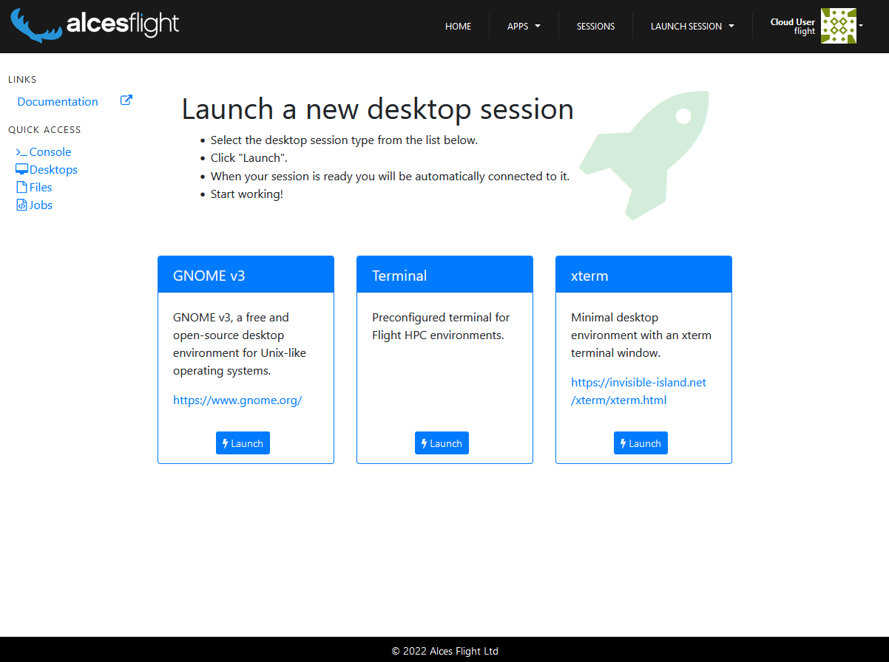
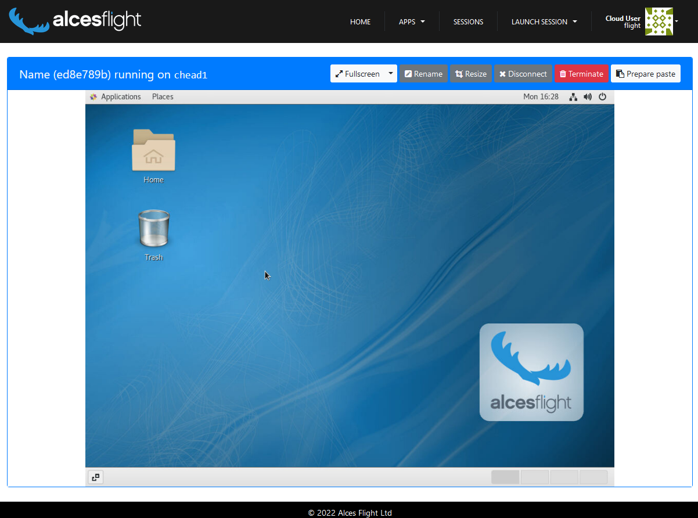

# Flight Desktop Web

The Flight Desktop web application provides a visual front-end to the [Flight Desktop CLI tool](../flight-user-suite/flight-desktop/index.md), allowing users an intuitive solution to managing remote desktop sessions. 

## Creating Desktop Session

To launch a desktop session for the cluster, select "Launch" from the management page then select the desired desktop environment to launch.

!!! note
    The only session types that will be displayed here are those that [have been prepared](../flight-user-suite/flight-desktop/prepare.md#preparing-a-type) 

Upon selecting the desktop type various configuration options will appear, this allows the user to set the name and screen size of the session. 

After the user has set their options and selected launch, they will be connected to the session.

There are a few options for the desktop view, such as, making it _Full Screen_, changing to _Zen Mode_ (terminal focused with less widgets and buttons polluting the screen), disconnecting from the desktop session and terminating the session completely.

### A Note on Pasting

The desktop web suite does allow for remote & local clipboard integration. If text is copied on the remote session then it will be immediately available on the local clipboard.

For copying local data to the remote session a little bit of a workaround is needed:

- Copy text
- Click "Prepare Paste" in the desktop webapp (located in the top right of the screen)
    
- Paste text into the pop up box, and click "ok"
- Paste text in the remote session

## Managing Desktop Sessions

Selecting the "My Sessions" link in the header will present all existing desktop sessions for the user, from here sessions can be connected to or terminated through the corresponding buttons. Additionally, this session manager will generate previews of the various desktop sessions to make it easier to identify the different active sessions.

