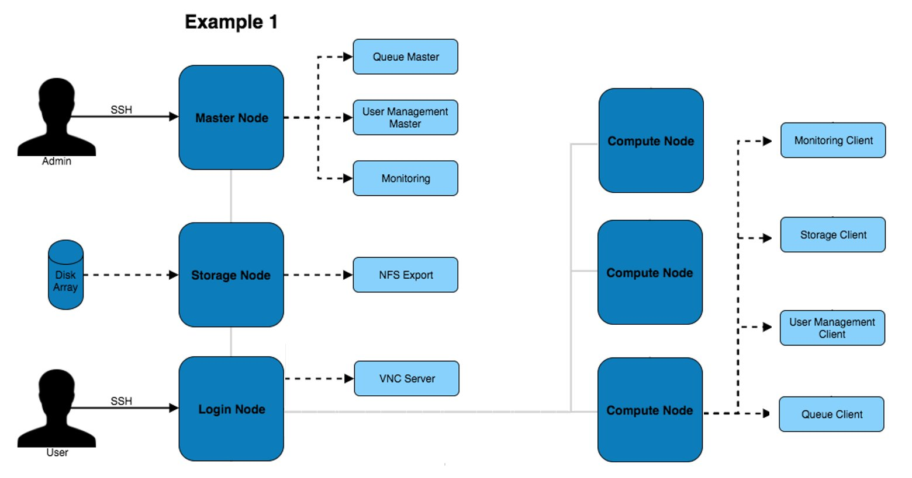
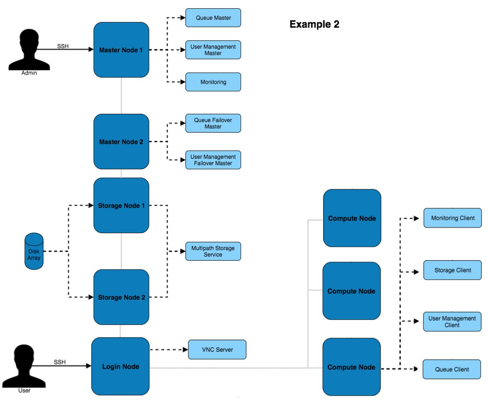
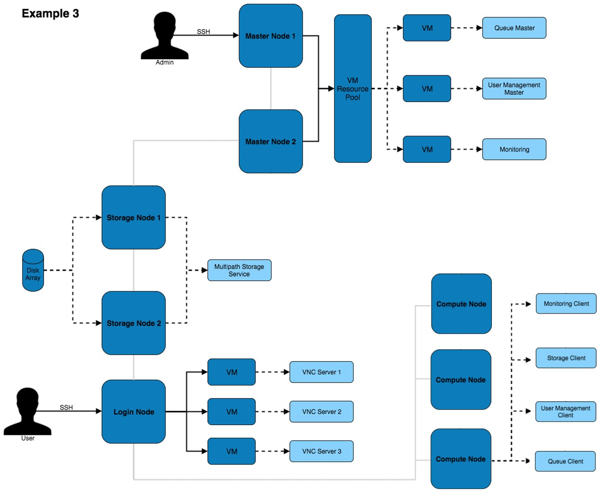
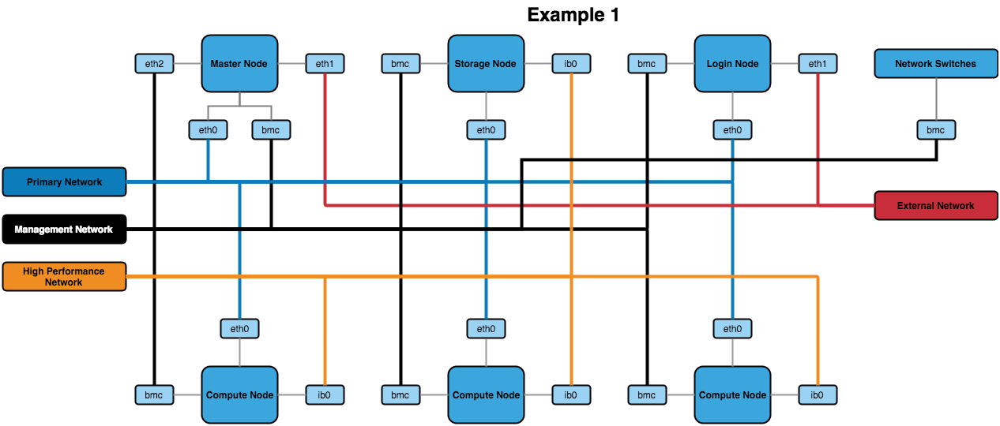
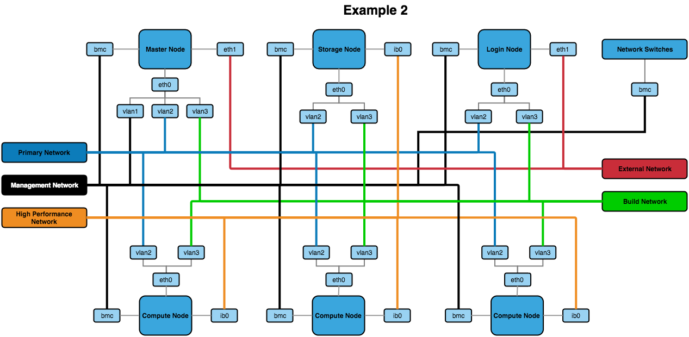

# Considerations for Network and Hardware Design

In general, the things to consider when designing the hardware and network solution for a HPC platform are:

- The hardware environment
- The types of nodes required in the network
- The different networks to be used by the network
- The level of resilience desired
- The hostname and domain naming convention

These topics are covered in more detail below.

## Hardware Environment

The hardware environment will generally be one of two setups, metal or cloud.

- **Metal** - Metal environments are those which are composed of on-site systems in a datacenter which are usually running 24/7.
- **Cloud** - Cloud environments are systems hosted in a third-party datacenter (or on-premise private cloud) and are usually ephemeral systems that are being created and destroyed on demand.
- **Metal/Cloud Hybrid** - A hybrid environment usually consists of a core metal configuration that uses cloud as an overflow for additional capacity at times of high utilisation.

A hardware environment is mainly focussed on the location, capacity and permanence of the HPC platform and does not directly determine the hardware that will be used in the various systems.

## Node Types

A complete HPC platform will be comprised of systems that serve different purposes within the network. Ideas of node types along with the services and purpose of those nodes can be seen below.

- **Login Node** - A login node will usually provide access to the HPC platform and will be the central system that users access to run applications. How users will access the system should be considered, usually this will be SSH and some graphical login service, such as, VNC.
- **Master Node** - A master node will usually run services for the HPC platform. Such as, the master process for a job scheduler, monitoring software and user management services.
- **Compute Node** - Compute nodes are usually used for running HPC applications that are queued through a job scheduler. Additionally, these can be used for VM deployments (via software like OpenStack) or other computational uses. Compute nodes usually have large amounts of cores and memory as well as high bandwidth interconnect (like Infiniband).
- **Special-purpose Node** - Some compute nodes may feature a particular specification to be used for a particular job, or stage in your workflow. Examples may include nodes with more memory, larger amounts of local scratch storage, or GPU/FPGA devices installed.
- **Storage Node** - The storage node will serve network storage solutions to systems on the network. It would have some sort of storage array connected to it which would provide large and resilient storage.

The above types are not strict. Services can be mixed, matched and moved around to create the desired balance and distribution of services and functions for the platform.

## Different Networks

The network in the system will most likely be broken up (physically or virtually with VLANs) into separate networks to serve different usages and isolate traffic. Potential networks that may be in the HPC platform are:

- **Primary Network** - The main network that all systems are connected to.
- **Out-of-Band Network** - A separate network for management traffic. This could contain on-board BMCs, switch management ports and disk array management ports. Typically this network would only be accessible by system administrators from within the HPC network.
- **High Performance Network** - Usually built on an Infiniband fabric, the high performance network would be used by the compute nodes for running large parallel jobs over MPI. This network can also be used for storage servers to provide performance improvements to data access.
- **External Networks** - The network outside of the HPC environment that nodes may need to access. For example, the *Master Node* could be connected to an *Active Directory* server on the external network and behave as a slave to relay user information to the rest of the HPC environment.
- **Build Network** - This network can host a DHCP server for deploying operating systems via PXE boot kickstart installations. It allows for systems that require a new build or rebuild to be flipped over and provisioned without disturbing the rest of the network.
- **DMZ** - A demilitarised zone would contain any externally-facing services, this could be setup in conjunction with the external networks access depending on the services and traffic passing through.

The above networks could be physically or virtually separated from one another. In a physical separation scenario there will be a separate network switch for each one, preventing any sort of cross-communication. In a virtually separated network there will be multiple bridged switches that separate traffic by dedicating ports (or tagging traffic) to different VLANs. The benefit of the VLAN solution is that the bridged switches (along with bonded network interfaces) provides additional network redundancy.

!!! note
    If a cloud environment is being used then it is most likely that all systems will reside on the primary network and no others. This is due to the network configuration from the cloud providers.

## Resilience

How well a system can cope with failures is crucial when delivering a HPC platform. Adequate resilience can allow for maximum system availability with a minimal chance of failures disrupting the user. System resilience can be improved with many hardware and software solutions, such as:

- **RAID Arrays** - A RAID array is a collection of disks configured in such a way that they become a single storage device. There are different RAID levels which improve data redundancy or storage performance (and maybe even both). Depending on the RAID level used, a disk in the array can fail without disrupting the access to data and can be hot swapped to rebuild the array back to full functionality. [^1]
- **Service Redundancy** - Many software services have the option to configure a failover server that can take over the service management should the master process be unreachable. Having a secondary server that mirrors critical network services would provide suitable resilience to master node failure.
- **Failover Hardware** - For many types of hardware there is the possibility of setting up failover devices. For example, in the event of a power failure (either on the circuit or in a power supply itself) a redundant power supply will continue to provide power to the server without any downtime occurring.

There are many more options than the examples above for improving the resilience of the HPC platform, it is worth exploring and considering available solutions during design.

!!! info
    Cloud providers are most likely to implement all of the above resilience procedures and more to ensure that their service is available 99.99% of the time.

## Hostname and Domain Names

Using proper domain naming conventions during design of the HPC platform is best practice for ensuring a clear, logical and manageable network. Take the below fully qualified domain name::

```
node01.pri.cluster1.compute.estate
```

Which can be broken down as follows:

  - `node01` - The hostname of the system
  - `pri` - The network that the interface of the system is sat on (in this case, pri = primary)
  - `cluster1` - The cluster that `node01` is a part of
  - `compute` - The subdomain of the greater network that `cluster1` is a part of
  - `estate` - The top level domain

## Security

Network security is key for both the internal and external connections of the HPC environment. Without proper security control the system configuration and data is at risk to attack or destruction from user error. Some tips for improving network security are below:

- Restrict external access points where possible. This will reduce the quantity of points of entry, minimising the attack surface from external sources.
- Limit areas that users have access to. In general, there are certain systems that users would never (and should never) have access to so preventing them from reaching these places will circumvent any potential user error risks.
- Implement firewalls to limit the types of traffic allowed in/out of systems.

It is also worth considering the performance and usability impacts of security measures.

Much like with resilience, a Cloud provider will most likely implement the above security features - it is worth knowing what security features and limitations are in place when selecting a cloud environment.

!!! note
    Non-Ethernet networks usually cannot usually be secured to the same level as Ethernet so be aware of what the security drawbacks are for the chosen network technology.

## Additional Considerations and Questions

The below questions should be considered when designing the network and hardware solution for the HPC platform.

- How much power will the systems draw?
    - Think about the power draw of the selected hardware, it may be drawing a large amount of amps so sufficient power sources must be available.
- How many users are going to be accessing the system?
    - A complex, distributed service network would most likely be overkill and a centralised login/master node would be more appropriate.
- What network interconnect will be used?
    - It's most likely that different network technologies will be used for [different-networks](#different-networks). For example, the high performance network could benefit from using Infiniband as the interconnect.
- How could the hardware be optimised?
    - BIOS settings could be tweaked on the motherboard to give additional performance and stability improvements.
    - Network switch configurations could be optimised for different types of traffic
- What [types of nodes](#node-types) will be in the system?
- What applications are going to be run on the system?
    - Are they memory intensive?
    - Is interconnect heavily relied upon for computations?

[^1]: For more information on RAID arrays see [https://en.wikipedia.org/wiki/RAID](https://en.wikipedia.org/wiki/RAID)

## Recommendations

Below are some different recommendations for hardware and network design. These can vary depending on the number of users and quanttity of systems within the HPC platform.

### Hardware Recommendations

Useful recommendations for blades, network switches and storage technologies can be found in the [Alces Software knowledgebase](https://github.com/alces-software/knowledgebase/wiki)

With the above in mind, diagrams of different architectures are below. They increase in complexity and redundancy as the list goes on.

#### Example 1 - Standalone



The above architecture consists of master, login and compute nodes. The services provided by the master & login nodes can be seen to the right of each node type. This architecture only separates the services for users and admins.

#### Example 2 - High Availability



This architecture provides additional redundancy to the services running on the master node. For example, the disk array is connected to both master nodes which use multipath to ensure the higher availability of the storage device.

#### Example 3 - HA VMs



This architecture puts services inside of VMs to improve the ability to migrate and modify services with little impact to the other services and systems on the architecture. Virtual machines can be moved between VM hosts live without service disruption allowing for hardware replacements to take place on servers.

### Network Designs

The above architectures can be implemented with any of the below network designs.

#### Example 1- Simple



The above design contains the minimum recommended internal networks. A primary network (for general logins and navigating the system), a management network (for BMC management of nodes and switches) and a high performance Infiniband network (connected to the nodes). The master and login nodes have access to the external network for user and admin access to the HPC network.

!!! tip
    The master node could additionally be connected to the high performance network so that compute nodes have a faster network connection to storage.

#### Example 2 - VLANs



The above network design has a few additions to the first example. The main change is the inclusion of VLANs for the primary, management and build networks (with the build network being a new addition to this design). The build network allows for systems to be toggled over to a DHCP system that uses PXE booting to kickstart an OS installation.

### Other Recommendations

#### BIOS Settings

It's recommended to ensure that the BIOS settings are reset to default and the latest BIOS version is installed before optimising the settings. This can ensure that any issues that may be present in the configuration before proceeding have been removed.

When it comes to optimising the BIOS settings on a system in the network, the following changes are recommended:

- Setting the power management to maximum performance
- Disabling CPU CStates
- Disabling Hyperthreading
- Enabling turbo mode
- Disabling quiet boot
- Setting BMC to use the dedicated port for BMC traffic
- Setting the node to stay off when power is restored after AC power loss

!!! note
    The wordings for settings above may differ depending on the hardware that is being used. Look for similar settings that can be configured to achieve the same result.

For hardware-specific BIOS configuration settings see the [Alces Software knowledgebase](https://github.com/alces-software/knowledgebase/wiki#servers) which has many recommendations based on their experience with integrating HPC environments.

