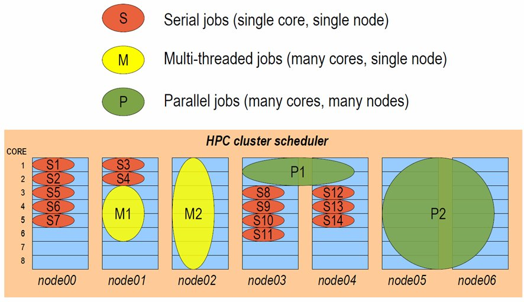

# Types of Compute Job

## Local Job

### Why Run a Local Job?

When using a personal research environment there isn't a need to monitor resource usage as closely as multi-user systems where miscommunication and overloaded resources can negatively impact research progress. With all the resources available to one user it is quicker and easier to run jobs simply through a terminal than using a queue system.

Local jobs also have the benefit over schedulers by launching immediately and providing all output through a single terminal.

### Running a Local Job

Local job scripts can be written in any language supported within the research environment. In most cases this is likely to be bash as it's a flexible and functional shell scripting language which enables users to intuitely navigate the filesystem, launch applications and manage data output.

In the event that a job script is executable, contains a shebang(#!) specifying the launch language, and is in the current directory, it's as simple to run as:

```bash
[flight@chead1 ~]$ ./myjob.sh
```

## Scheduler Jobs

Users can run a number of different types of job via the research environment scheduler, including:

- **Batch jobs**; single-threaded applications that run only on one compute core
- **Array jobs**; two or more similar batch jobs which are submitted together for convenience
- **SMP** or **multi-threaded** jobs; multi-threaded applications that run on two or more compute cores on the same compute node
- **Parallel jobs**; multi-threaded applications making use of an MPI library to run on multiple cores spread over one or more compute nodes

The research environment job-scheduler is responsible for finding compute nodes in your research environment to run all these different types of jobs on. It keeps track of the available resources and allocates jobs to individual groups of nodes, making sure not to over-commit CPU and memory. The example below shows how a job-scheduler might allocate jobs of different types to a group of 8-CPU-core compute nodes:



### Interactive and Batch Jobs

Users typically interact with research environments by running either interactive or batch (also known as non-interactive) jobs.

- An interactive job is one that the user directly controls, either via a graphical interface or by typing at the command-prompt.
- A batch job is run by writing a list of instructions that are passed to compute nodes to run at some point in the future.

Both methods of running jobs can be equally as efficient, particularly on a personal, ephemeral research environment. Both classes of job can be of any type - for example, it's possible to run interactive parallel jobs and batch multi-threaded jobs across your research environment. The choice of which class of job-type you want to use will depend on the application you're running, and which method is more convenient for you to use.
