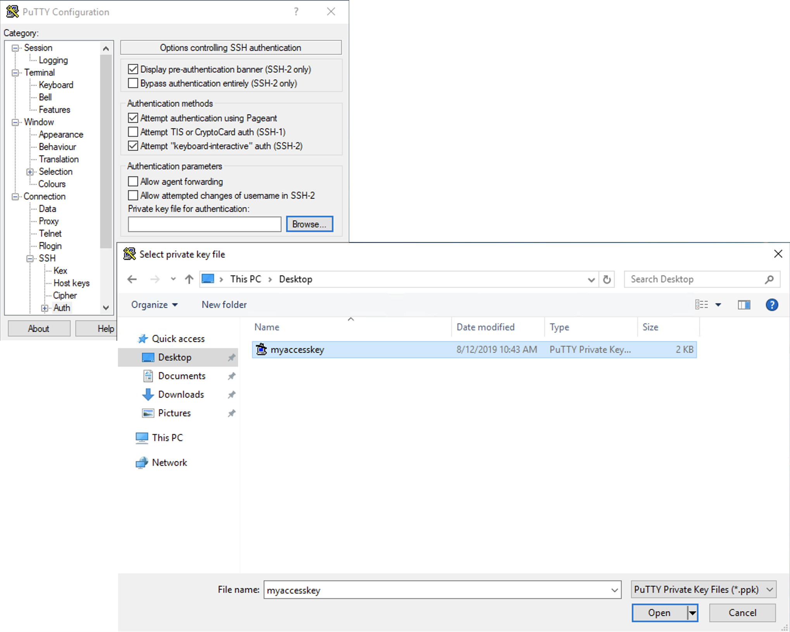
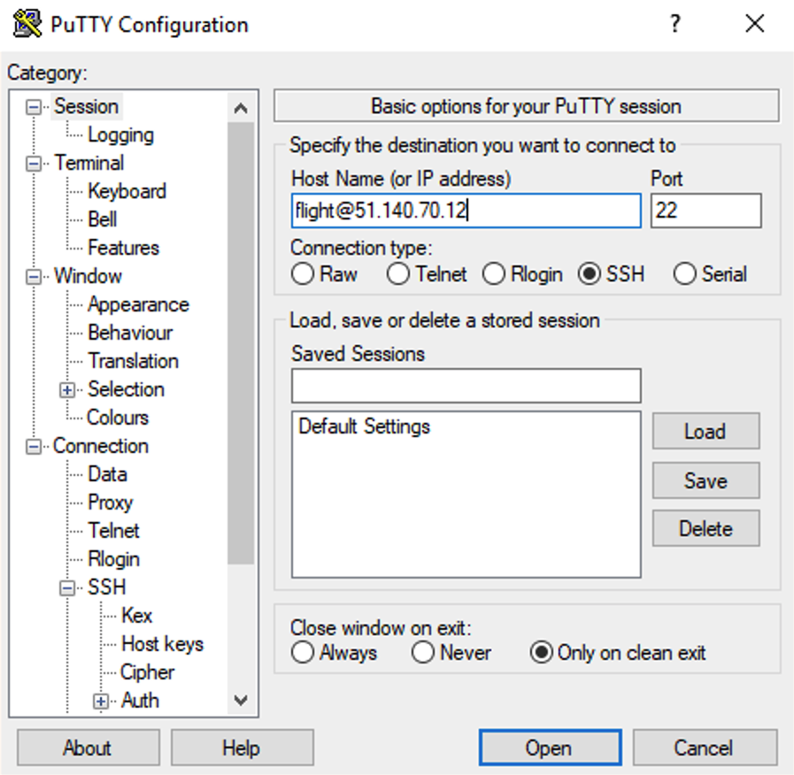
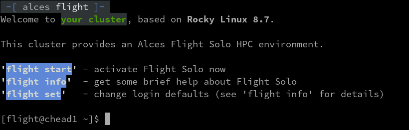

Usually a HPC environment will have a "login" or "gateway" node which is the entrypoint to the rest of the nodes.

You can access the login node for your research environment using SSH to connect to the externally facing IP address of the login node. You will need to use the SSH keypair configured for the research environment in order to access it.

When you login to the research environment via SSH, you are automatically placed in your home-directory. This area is shared across all compute nodes in the research environment, and is mounted in the same place on every compute node. Data copied to the research environment or created in your home-directory on the login node is also accessible from all compute nodes.

=== ":simple-linux: Linux / :simple-apple: Mac"

    To access the research environment login node from a Linux or Mac client, use the following command:
    ```bash
    ssh -i mypublickey.pem flight@52.50.141.144
    ```

    Where:

    - `mypublickey.pem` is the name of your private key associated with the public SSH key of your user 
    - `flight` is the username of the user on the research environment
    - `52.50.141.144` is the Access-IP address for the gateway node of the research environment

=== ":simple-windows: Windows"

    If you are accessing from a Windows client using the Putty utility, the private key associated with the account will need to be converted to ppk format from pem to be compatible with Putty. This can be done as follows:

    - Open PuTTYgen (this will already be installed on your system if Putty was installed using .msi and not launched from the .exe - if you do not think you have this, download putty-installer from [here](http://www.chiark.greenend.org.uk/~sgtatham/putty/latest.html)

    - Select Conversions -> Import Key

    - Locate .pem file and click open

    - Click Save Private Key

    - Answer Yes to saving without a passphrase

    - Input the name for the newly generated ppk to be saved as

    To load the key in Putty, select Connection -> SSH -> Auth, click Browse and select the ppk that was generated from the above steps.

    

    Next, enter the username and IP address of the research environment login node in the “Host Name” box provided (in the Session section):

    

    The first time you connect to your research environment, you will be prompted to accept a new server SSH hostkey. This happens because you’ve never logged in to your research environment before - it should only happen the first time you login; click **OK** to accept the warning. Once connected to the research environment, you should be logged in to the research environment login node as your user.

    

