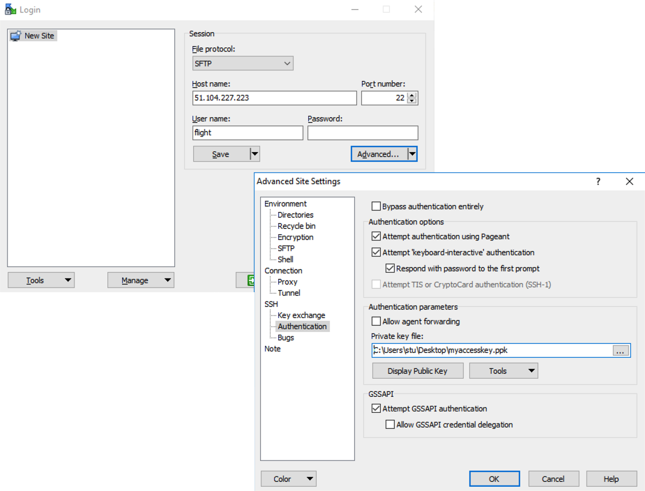
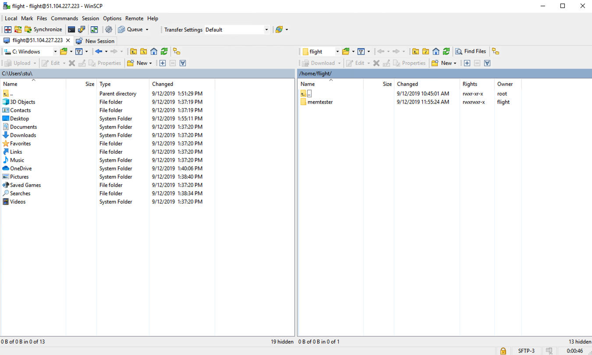

There are also a number of graphical file-management interfaces available that support the SSH/SCP/SFTP protocols. A graphical interface can make it easier for new users to manage their data, as they provide a simple drag-and-drop interface that helps to visualise where data is being stored. The example below shows how to configure the [WinSCP](https://winscp.net/eng/download.php) utility on a Windows client to allow data to be moved to and from a research environment.

- On a Windows client, download and install [WinSCP](https://winscp.net/eng/download.php)
- Start WinSCP; in the **login** configuration box, enter the IP address of your login node in the `Host name` box
- Enter the username you configured for your research environment in the `User name` box (e.g. `flight`)
- Click on the `Advanced` box and navigate to the `SSH` sub-menu, and the `Authentication` item
- In the `Private key file` box, select your research environment access private key, and click the `OK` box.

- Optionally click the `Save` button and give this session a name
- Click the `Login` button to connect to your research environment
- Accept the warning about adding a new server key to your cache; this message is displayed only once when you first connect to the research environment
- WinSCP will login to your research environment; the window shows your local client machine on the left, and the research environment on the right
- To copy files to the research environment from your client, click and drag them from the left-hand window and drop them on the right-hand window
- To copy files from the research environment to your client, click and drag them from the right-hand window and drop them on the left-hand window

The amount of time taken to copy data to and from your research environment will depend on a number of factors, including:

- The size of the data being copied
- The speed of your Internet link to the research environment; if you are copying large amounts of data, try to connect using a wired connection rather than wireless
- The type and location of your research environment login node in relation to your client location
