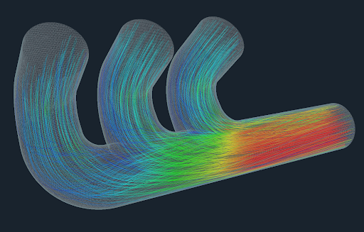

# OpenFOAM 

OpenFOAM is a popular engineering application toolbox. It's open source and is used for simulating fluid flow around objects. This section describes the different installation process available and how to run some basic jobs. Some parts in this section use the [Flight Silo](../../flight-environment/use-flight/flight-user-suite/flight-silo/index.md) tool to download necessary files.

