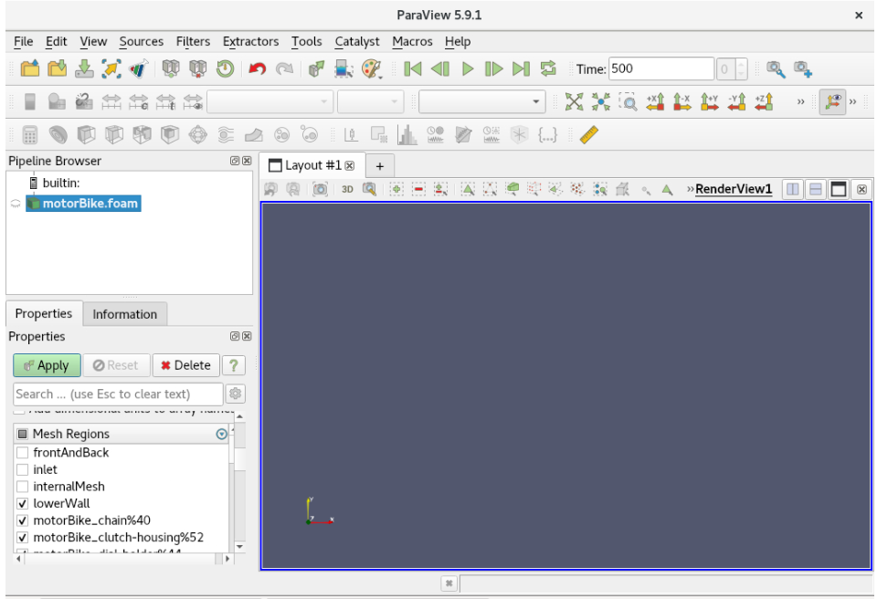
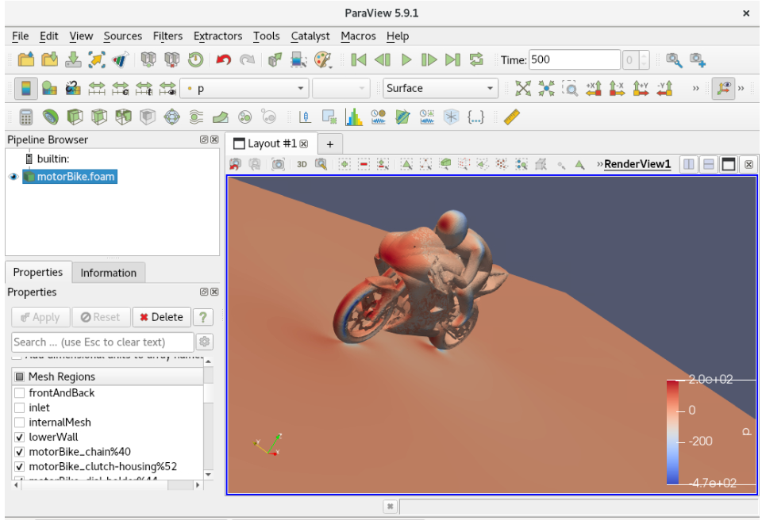

# OpenFOAM MPI Workflow Example 

!!! tip
    Your environment will need to have a job scheduler such as [Slurm](../../hpc-environment-basics/hpc-usage/slurm/index.md), which can be set up by following the [Flight Solo cluster build methods](../../flight-solo/cluster-build-methods/index.md).

## Prepare Job

1. Start by downloading this job directory in a location of your choice.
    ```bash
    flight silo file pull openflight:openfoam/motorBike.tar.gz
    ```

2. Decompress it, which will make a directory called `motorBike`.
    ```bash
    tar xf motorBike.tar.gz
    ```

3. Update the job configuration.
    1. Open `motorBike/system/decomposeParDict` and set:
        1. `X` to the number of processes to run across.
        1. `A B C` to be numbers such that `A`*`B`\*`C`=`X`

4. Update the job script.
    1. Open `motorBike/motorbike-example.sh`.
        1. Set `-n X` to the number of processes to run across.
        1. Set `source` to point to the location of OpenFOAM.

## Run Job

5. Submit the job script to the scheduler.
    ```bash
    sbatch motorBike/motorbike-example.sh
    ```

## View Results

Once the job has finished running, the results can be visualised through a desktop session.

1. Connect to VNC or web-suite desktop (For more information on launching desktops, see the [Flight Desktop section](../../flight-environment/use-flight/flight-user-suite/flight-desktop/index.md)).

2. Open a terminal and navigate to the job directory.

3. Launch Paraview
    ```bash
    source /opt/apps/OpenFOAM/OpenFOAM-v2212/etc/bashrc
    paraFoam
    ```

4. In the window that opens, go to the bottom left and scroll down to "Mesh parts". Select all the boxes  except `frontAndBack`, `inlet`, `internalMesh`, `outlet` and `upperWall`, and then click apply.

    

5. You should now see a motorbike along with a rider and the forces visualised on them!

    
