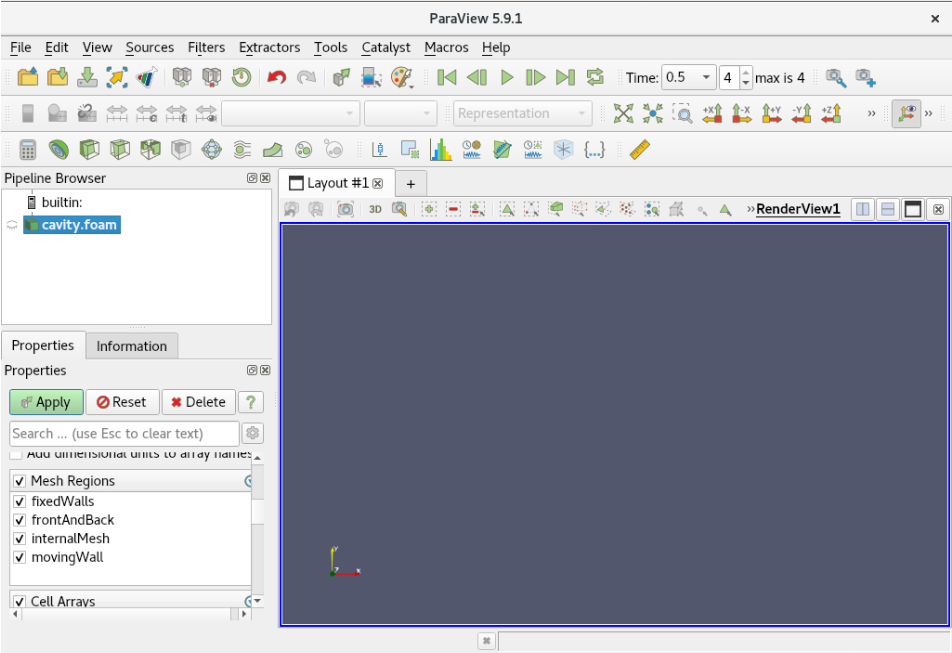

# Simple OpenFOAM Workflow Example

!!! tip
    Your environment will need to have a job scheduler such as [Slurm](../../hpc-environment-basics/hpc-usage/slurm/index.md), which can be set up by following the [Flight Solo cluster build methods](../../flight-solo/cluster-build-methods/index.md).

## Run Job

1. Download a job script to the working directory. This script assumes that it is being launched from the home directory, change it if that is not the case. It also cannot be run as the root user.

    ```bash
    flight silo file pull openflight:openfoam/cavity-example.sh
    ```

2. Submit the job to the queue system:
    ```bash
    sbatch cavity-example.sh
    ```

3. Check that the job is running (it may take some time to complete):
    ```bash
    squeue
    ```

## View Results

Once the cavity job has finished running, the results can be visualised through a desktop session.

1. Connect to VNC or web-suite desktop (For more information on launching desktops, see the [Flight Desktop section](../../flight-environ
ment/use-flight/flight-user-suite/flight-desktop/index.md)).

2. Navigate to the cavity directory and launch the paraFoam viewer:
    ```bash
    cd cavity
    paraFoam
    ```

3. In the window that opens, scroll down to "Mesh parts" and select all the boxes, then click apply
    

4. Next, change the display to 'U' in the dropdown menu, click play to change the timestamp and then click and drag to rotate the subject
    
