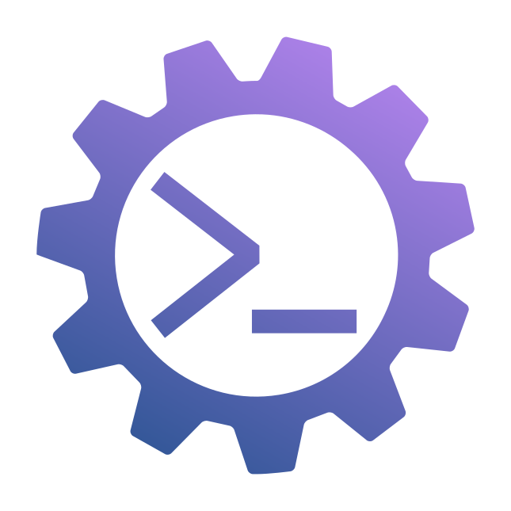

---
hide:
  - navigation
  - toc
search:
  exclude: true
---

<section id="landing-block" class="home-block no-tabs no-footer">
  

    
  

  

    <h1 id="home-header">HPC for everyone</h1>
    <h2 id="home-subheader">
      The open source software and expert knowledgebase making high performance computing accessible to all.
    </h2>
    <a class="button big-text" href="#mission-block">FIND OUT MORE</a>
  

</section>
<section id="cloud-block" class="home-block">
  
</section>
<section id="mission-block" class="home-block">
  

    <h1>The OpenFlight mission:</h1>
    

      The OpenFlight project seeks to provide HPC workflow knowledge 
      to the community for a range of subjects, applications and workloads 
      to minimise the skill gaps to utilising HPC systems.
    

  

  
</section>
<section id="tools-block" class="home-block">
  <h1>Open source tools</h1>
  

    

      
      

        <h2>User suite</h2>
        

          Flight User Suite provides CLI tools for accessing your cluster from the command line. 
        

      

      <a class="button" href="docs/flight-environment/use-flight/flight-user-suite">LEARN MORE</a>
    

    

      
      

        <h2>Web suite</h2>
        

          Flight Web Suite provides GUI tools for accessing your cluster from within your web browser.
        

      

      <a class="button" href="docs/flight-environment/use-flight/flight-web-suite">LEARN MORE</a>
    

    

      
      

        <h2>Flight Solo</h2>
        

          Flight Solo is a preconfigured image designed to get users into HPC as quickly as possible.
        

      

      <a class="button" href="solo">LEARN MORE</a>
    

  

</section>
<section id="green-block" class="home-block">
  

    

      <h1>Greener HPC</h1>
      

        The project aims to inform the community of methods for defining their 
        computational requirements. This can reduce computational waste, resulting 
        in a greener workflow.
      

    

    
  

</section>
<section id="ready-block" class="home-block">
  

    <h1>Ready to get started?</h1>
    

      Begin creating your HPC solution by reading the OpenFlight documentation 
      or start creating a cluster with Flight Solo.
    

    

      <a class="button" href="docs">GO TO DOCUMENTATION</a>
      <a class="button" href="solo">GET FLIGHT SOLO</a>
    

  

</section>

  
  
  

