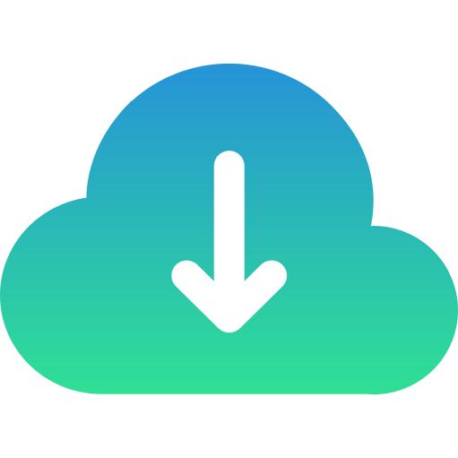

---
hide:
  - navigation
  - toc
title: "Flight Solo"
search:
  exclude: true
---

  

  

    <h1>
      
    </h1>
    

      

        Flight Solo is an HPC-ready, platform-agnostic image approach to deploying HPC resources. 
        The Flight Solo image provides a personal High Performance Computing (HPC) environment for research and scientific 
        computing.
      

    

    

      <a class="solo-card card link"
         href="../docs/flight-solo">
        
        <h2 class="card-text">Read the docs</h2>
        

          Find out how to start using Flight Solo by reading the OpenFlight documentation.
        

      </a>
      <a class="solo-card card link"
         href="https://aws.amazon.com/marketplace/pp/prodview-q5u533n6b34oc?sr=0-1&ref_=beagle&applicationId=AWSMPContessa"
         target="_blank"
      >
        
        <h2 class="card-text">AWS</h2>
        

          Go to AWS marketplace and start a Flight Solo instance.
        

      </a>
      <a class="solo-card card link" 
         href="https://repo.openflighthpc.org/?prefix=images/FlightSolo/"
         target="_blank"
      >
        
        <h2 class="card-text">Download</h2>
        

          Download the Flight Solo image from the OpenFlight repository.
        

      </a>
    

  

  

