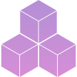

---
hide:
  - navigation
  - toc
title: "Flight Workshop"
search:
  exclude: true
---

  

    <h1>{{ title }}</h1>
    

      Choose from our selection of free templates to start building a cluster using your private cloud resources.
    

  

  <a class="card template-card" href="slurm-team-edition">
    <h2 class="template-header card-text">SLURM: Team Edition</h2>
    
    

      <ul class="template-stats card-text">
        <li> 
          <i class="template-stats-icon fa-solid fa-users" title="Number of users"></i>
           1 - 10 
        </li>
        <li> 
          <i class="template-stats-icon fa-solid fa-clock" title="Lifetime"></i> 
           1 - 3 months 
        </li>
        <li> 
          <i class="template-stats-icon fa-solid fa-database" title="Storage"></i> 
           1TB 
        </li>
        <li> 
          <i class="template-stats-icon fa-solid fa-credit-card" title="Estimated running costs"></i> 
           $10 / day 
        </li>
        <li> 
          <i class="template-stats-icon fa-solid fa-dumbbell" title="Capability"></i> 
           Low 
        </li>
      </ul>
      
        A small collaborative environment, great for teams running short projects. 
      
    

  </a>

